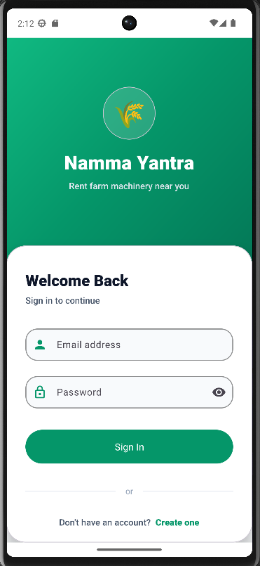
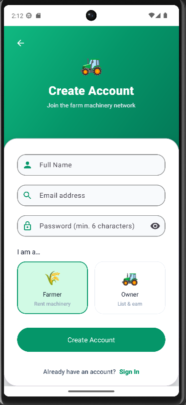
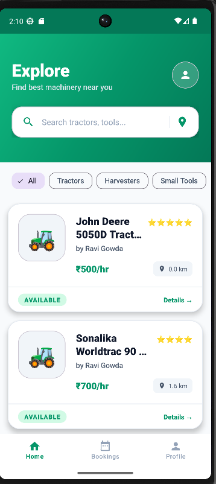
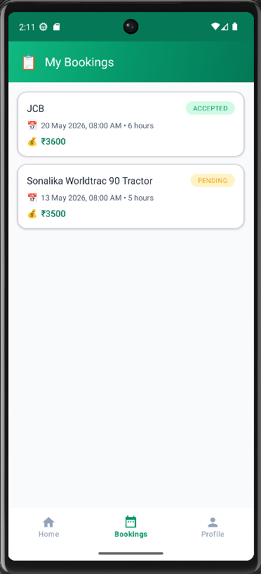
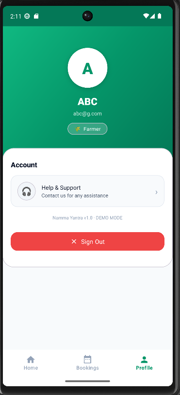

# 🌾 Namma Yantra Share

> **"Uber for Tractors"** — A peer-to-peer farm machinery rental platform connecting small farmers with equipment owners across Karnataka.

---

## 📋 Project Title

**Project #51 — Android App Development using GenAI: Namma-Yantra Share (Agriculture / Self-Employment)**

*MindMatrix VTU Internship Program*

---

## 🚜 Problem Statement

Small and marginal farmers in rural India cannot afford to purchase heavy agricultural machinery like Tractors or Power Tillers. Large farm owners possess these machines, yet they sit **idle for 15–20 days a month**. There is no easy, middleman-free way for a small farmer to rent nearby machinery on demand.

**Namma Yantra Share** solves this by creating a direct, transparent, and digital rental marketplace — where machinery owners can list their equipment and farmers can discover, book, and pay for it — all from a mobile phone.

---

## 💡 The Vision

Namma Yantra Share is a **peer-to-peer agricultural machinery rental app** — think of it as an "Uber for Tractors." Owners list their machines along with hourly or daily rates. Nearby farmers browse the catalogue, check availability in real time, select a date/time, and send a booking request. No phone calls, no middlemen, no guesswork.

---

## ✨ Features

### 👨‍🌾 Farmer (Renter) Side
| Feature | Description |
|---|---|
| **Explore Feed** | Browse Tractors, Harvesters, Sprayers, and more from nearby owners |
| **Category Filters** | Filter by All / Tractors / Harvesters / Small Tools |
| **Live Search** | Instant text search across machine names |
| **Distance Display** | Real distance from the farmer's current GPS location to each machine |
| **Availability Badge** | Green "AVAILABLE" tag shown in real time via Firestore |
| **Machine Detail View** | Full details — owner name, condition rating (stars), hourly & daily rate, description, last service date |
| **Price Calculator** | Automatic total price calculation: `Duration × Rate = Total (₹)` |
| **Booking Calendar** | Date + time picker with hourly/daily duration selector |
| **My Bookings** | Track all bookings with live status — Pending / Accepted / Declined |
| **Profile Page** | View account info and role badge |

### 🏭 Owner (Lessor) Side
| Feature | Description |
|---|---|
| **Owner Dashboard** | Central hub listing all registered machines |
| **Add Machine** | Register new machinery with name, description, hourly rate, daily rate, condition, GPS location |
| **Incoming Requests** | View, Accept, or Decline rental requests from farmers |
| **Machine Status** | Mark machines as Available / Unavailable |

### 🔐 Authentication
- Email + Password sign-up and login via **Firebase Authentication**
- Role selection at registration: **Farmer** (Rent machinery) or **Owner** (List & earn)
- Demo Mode for offline testing without Firebase

---

## 🛠️ Tech Stack

| Layer | Technology |
|---|---|
| **Language** | Kotlin |
| **Platform** | Android (Native) |
| **Min SDK** | API 24 (Android 7.0 Nougat) |
| **Target SDK** | API 35 (Android 15) |
| **Build System** | Gradle (AGP 8.13.2) |
| **Architecture** | MVVM (Model–View–ViewModel) |
| **UI** | XML Layouts + ViewBinding + Material Design 3 |
| **Authentication** | Firebase Authentication (Email/Password) |
| **Database** | Firebase Firestore (real-time NoSQL) |
| **Location** | Google Play Services Location API (FusedLocationProviderClient) |
| **Async** | Kotlin Coroutines + LiveData |
| **DI / State** | ViewModel + Repository pattern |
| **Navigation** | Bottom Navigation View (3-tab: Home / Bookings / Profile) |

### Key Dependencies
```gradle
// Firebase
implementation platform('com.google.firebase:firebase-bom:33.1.2')
implementation 'com.google.firebase:firebase-auth-ktx'
implementation 'com.google.firebase:firebase-firestore-ktx'

// Location
implementation 'com.google.android.gms:play-services-location:21.3.0'

// Lifecycle / Coroutines
implementation 'androidx.lifecycle:lifecycle-viewmodel-ktx:2.8.4'
implementation 'org.jetbrains.kotlinx:kotlinx-coroutines-android:1.8.1'

// UI
implementation 'com.google.android.material:material:1.12.0'
implementation 'androidx.recyclerview:recyclerview:1.3.2'
```

---

## 📲 Screenshots

| Login | Sign Up | Home / Explore |
|---|---|---|
|  |  |  |

| My Bookings | Profile |
|---|---|
|  |  |

> Screenshots show the app running in Demo Mode with pre-seeded mock data.

---

## 🔗 Demo

> **Demo Mode** is built directly into the app. Set `DEMO_MODE = true` in `Constants.kt` to run the app with mock data — no Firebase account or internet connection required.

```kotlin
// app/src/main/java/com/nammayantra/share/util/Constants.kt
object Constants {
    const val DEMO_MODE = true   // ← flip this to enable offline demo
}
```

---

## ⚙️ Installation & Setup

### Prerequisites
- Android Studio **Hedgehog (2023.1.1)** or newer
- JDK 17
- Android device / emulator running **Android 7.0 (API 24)** or higher
- A Firebase project (skip if using Demo Mode)

### Step 1 — Clone / Extract the Project
```bash
# If cloning from GitHub
git clone https://github.com/<your-username>/namma-yantra-share.git
cd namma-yantra-share

# Or extract the provided ZIP
unzip "Namma_Yantra_Share"
cd "Namma Yantra App"
```

### Step 2 — Open in Android Studio
1. Launch Android Studio
2. Choose **File → Open**
3. Navigate to and select the `Namma Yantra App` folder
4. Wait for Gradle sync to complete

### Step 3 — Firebase Setup (skip for Demo Mode)
1. Go to [Firebase Console](https://console.firebase.google.com/) and create a new project
2. Add an **Android app** with package name: `com.nammayantra.share`
3. Download the `google-services.json` file
4. Replace `app/google-services.json` with your downloaded file
5. Enable **Authentication → Email/Password** in the Firebase Console
6. Enable **Firestore Database** and set rules:
```
rules_version = '2';
service cloud.firestore {
  match /databases/{database}/documents {
    match /{document=**} {
      allow read, write: if request.auth != null;
    }
  }
}
```

### Step 4 — Configure Demo vs Live Mode
Open `app/src/main/java/com/nammayantra/share/util/Constants.kt`:
```kotlin
object Constants {
    const val DEMO_MODE = false   // false = uses real Firebase; true = offline demo data
}
```

### Step 5 — Grant Location Permission
The app requests **Fine Location** permission at runtime to calculate distances from the farmer's field to nearby machines. Allow this when prompted on-device.

---

## ▶️ Run Command

### Via Android Studio
1. Connect an Android device via USB (enable Developer Options + USB Debugging) **or** start an AVD emulator
2. Select your device from the device dropdown
3. Click the **▶ Run** button (or press `Shift + F10`)

### Via Command Line (Gradle)
```bash
# Debug build (development)
./gradlew assembleDebug

# Install directly to connected device
./gradlew installDebug

# Run all unit tests
./gradlew test

# Release build
./gradlew assembleRelease
```

The debug APK is generated at:
```
app/build/outputs/apk/debug/app-debug.apk
```

---

## 🗂️ Folder Structure

```
Namma Yantra App/
├── app/
│   ├── build.gradle                          # App-level dependencies & SDK config
│   ├── google-services.json                  # Firebase project config
│   └── src/
│       └── main/
│           ├── AndroidManifest.xml           # Activities, permissions declaration
│           ├── java/com/nammayantra/share/
│           │   ├── data/
│           │   │   ├── model/
│           │   │   │   ├── Booking.kt        # Booking data model
│           │   │   │   ├── Machine.kt        # Machine data model (with emoji helper)
│           │   │   │   ├── MachineUi.kt      # UI wrapper for machine + distance
│           │   │   │   └── User.kt           # User data model
│           │   │   └── repository/
│           │   │       ├── AuthRepository.kt     # Login, signup, logout logic
│           │   │       ├── BookingRepository.kt  # Booking CRUD with Firestore
│           │   │       └── MachineRepository.kt  # Machine listing & availability
│           │   ├── ui/
│           │   │   ├── adapters/
│           │   │   │   ├── BookingAdapter.kt       # RecyclerView: booking cards
│           │   │   │   ├── MachineAdapter.kt       # RecyclerView: machine cards
│           │   │   │   └── OwnerMachineAdapter.kt  # RecyclerView: owner dashboard
│           │   │   ├── auth/
│           │   │   │   ├── AuthViewModel.kt        # Auth state & logic
│           │   │   │   ├── LoginActivity.kt        # Login screen
│           │   │   │   └── SignupActivity.kt       # Sign-up + role selection screen
│           │   │   ├── bookings/
│           │   │   │   ├── MyBookingsFragment.kt   # Farmer's booking list
│           │   │   │   └── MyBookingsViewModel.kt
│           │   │   ├── detail/
│           │   │   │   ├── EquipmentDetailActivity.kt  # Machine detail + booking form
│           │   │   │   └── DetailViewModel.kt
│           │   │   ├── home/
│           │   │   │   ├── HomeFragment.kt         # Explore feed with filters & search
│           │   │   │   └── HomeViewModel.kt
│           │   │   ├── main/
│           │   │   │   └── MainActivity.kt         # Bottom-nav host activity
│           │   │   ├── owner/
│           │   │   │   ├── AddMachineActivity.kt   # Form to add a new machine
│           │   │   │   ├── OwnerDashboardActivity.kt
│           │   │   │   └── OwnerDashboardViewModel.kt
│           │   │   ├── profile/
│           │   │   │   ├── ProfileFragment.kt      # User profile + sign out
│           │   │   │   └── ProfileViewModel.kt
│           │   │   └── splash/
│           │   │       └── SplashActivity.kt       # Launch screen + auth redirect
│           │   └── util/
│           │       ├── Constants.kt            # DEMO_MODE toggle
│           │       ├── DistanceUtils.kt        # Haversine distance calculation
│           │       ├── PriceCalculator.kt      # duration × rate = total
│           │       └── Resource.kt             # Generic Loading/Success/Error wrapper
│           └── res/
│               ├── drawable/                  # Vector icons & background shapes
│               ├── layout/                    # XML screen & item layouts
│               │   ├── activity_login.xml
│               │   ├── activity_signup.xml
│               │   ├── activity_splash.xml
│               │   ├── activity_main.xml
│               │   ├── activity_equipment_detail.xml
│               │   ├── activity_owner_dashboard.xml
│               │   ├── activity_add_machine.xml
│               │   ├── fragment_home.xml
│               │   ├── fragment_my_bookings.xml
│               │   ├── fragment_profile.xml
│               │   ├── item_machine.xml
│               │   ├── item_booking.xml
│               │   └── item_owner_machine.xml
│               ├── menu/
│               │   └── menu_bottom_nav.xml    # Bottom navigation items
│               ├── color/
│               │   └── bottom_nav_color.xml
│               └── values/
│                   ├── colors.xml             # App colour palette
│                   ├── strings.xml            # All user-facing strings
│                   ├── themes.xml             # Material3 theme definitions
│                   └── dimens.xml             # Spacing & size tokens
├── build.gradle                               # Project-level plugin versions
├── gradle.properties                          # Gradle JVM flags
└── settings.gradle                            # Module inclusion
```

---

## 🔑 Key Business Logic

### Price Calculator
```kotlin
// PriceCalculator.kt
fun total(machine: Machine, duration: Int, durationType: String): Double {
    return if (durationType == "daily")
        machine.dailyRate * duration
    else
        machine.hourlyRate * duration
}
// Example: 4 hours × ₹500/hr = ₹2,000
```

### Booking Status Flow
```
Farmer submits request → [Pending] → Owner accepts → [Accepted]
                                   → Owner declines → [Declined]
```

### Distance Calculation
Uses the **Haversine formula** to compute the great-circle distance (km) between the farmer's GPS coordinates and the machine's registered location — shown on each machine card.

---

## 🚀 Future Improvements

| # | Feature | Description |
|---|---|---|
| 1 | **In-App Payments** | Integrate Razorpay / UPI to enable end-to-end cashless transactions |
| 2 | **Push Notifications** | FCM notifications to alert owners of new requests and farmers of booking status changes |
| 3 | **Machine Health Tracking** | Real service log for each machine — maintenance history, next service due date |
| 4 | **Photo Uploads** | Let owners attach photos of their machinery for buyer confidence |
| 5 | **Rating & Reviews** | Two-way star ratings after each rental to build trust on both sides |
| 6 | **Map View** | Show available machines as pins on a Google Map |
| 7 | **Regional Language Support** | Kannada, Telugu, Tamil UI for wider rural adoption |
| 8 | **Offline Mode** | Cache nearby machine data for areas with poor connectivity |
| 9 | **SMS OTP Auth** | Phone number-based login (more accessible for rural users than email) |
| 10 | **Analytics Dashboard** | Earnings graph and booking history charts for machine owners |

---

## 🧑‍💻 Built By

Developed as part of the **MindMatrix VTU Internship Program** — Project #51.

Architecture: **MVVM** | Backend: **Firebase** | Platform: **Android (Kotlin)**

---

## 📄 License

This project is for educational and internship demonstration purposes under the MindMatrix VTU Internship Program.
